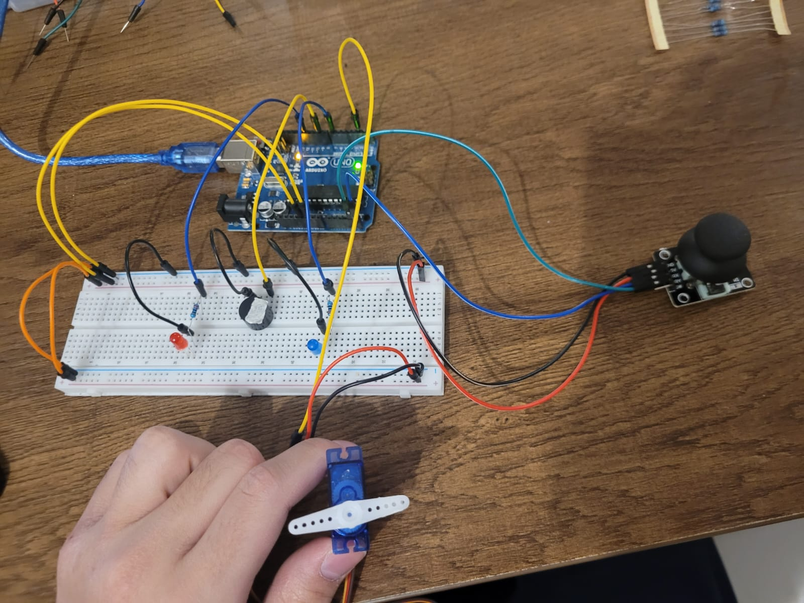
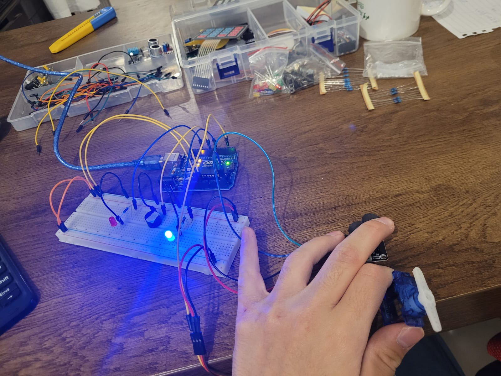
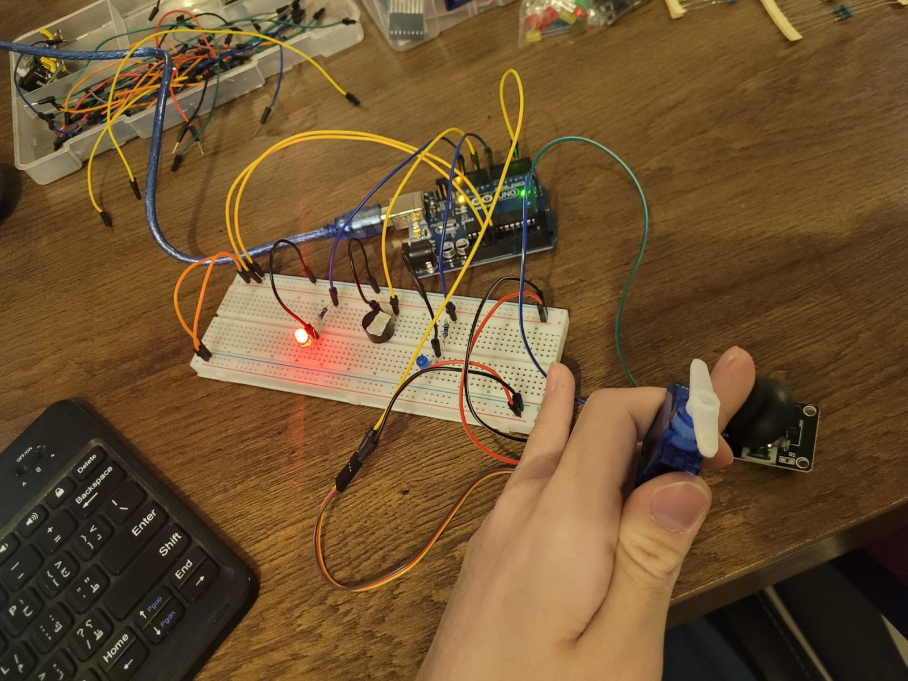

# Arduino---Joystick-Controlled-Servo-with-LED-and-Buzzer


# Description:
Arduino---Joystick-Controlled-Servo-with-LED-and-Buzzer

This project is an Arduino-based control system that uses a joystick to interact with a servo motor, two LEDs, and a buzzer. The servo motor rotates based on the joystick's horizontal position, and visual/audible feedback is provided depending on the direction of movement.

---

Behavior:

Joystick moved to the right:

The servo angle increases, rotating toward the right.

The blue LED turns ON.

The buzzer is activated.


Joystick moved to the left:

The servo angle decreases, rotating toward the left.

The red LED turns ON.

The buzzer is activated.


Joystick in the center position:

The servo motor moves to its neutral/middle angle.

No LEDs are turned on.

The buzzer remains OFF.

---

This project demonstrates how to use a joystick to control servo positioning and provide direction-based alerts through lights and sound.


# Pictures:





# Code Below:
```cpp
#include <Servo.h>


Servo servo;


int pinX = A5;
int pinY = A4;
byte blueLED = 7;
byte redLED = 12;
byte buzzer = 9;


int xRead;
byte angle;
byte lastAngle;


void setup() {
  servo.attach(2);
  Serial.begin(9600);
  pinMode(redLED, OUTPUT);
  pinMode(blueLED, OUTPUT);
  pinMode(buzzer, OUTPUT);
  delay(1000);
}

void loop() {
  xRead = analogRead(pinX);

  angle = map(xRead, 0, 1023, 0, 180);

  if (angle > lastAngle){
    digitalWrite(blueLED, HIGH);
    digitalWrite(redLED, LOW);
    digitalWrite(buzzer, HIGH);
  }

  else if (angle < lastAngle){
    digitalWrite(redLED, HIGH);
    digitalWrite(blueLED, LOW);
    digitalWrite(buzzer, HIGH);
  }

  if (xRead < 525 && xRead > 495){
    servo.write(512);
    digitalWrite(redLED, LOW);
    digitalWrite(blueLED, LOW);
    digitalWrite(buzzer, LOW);
  }
  
  servo.write(angle);

  lastAngle = angle;

  Serial.print("X value= ");
  Serial.println(xRead);
  delay(300);
}
```
